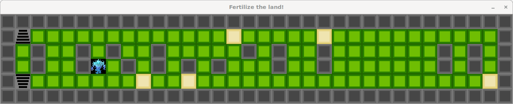

# so_long

Simple 2D tile-based game for the 42 school project "so_long" built in C.

## Overview

- Minimal tile-based game where the player navigates a map, collects items, and reaches the exit.
- Maps are provided in the `maps/` folder with the `.ber` extension.



**Requirements**
- Unix-like OS (Linux recommended for this repo).
- C compiler: `cc` (Makefile uses `cc`).
- X11 and MiniLibX available on your system (the Makefile links with `-lmlx -lXext -lX11 -lm`).

On Debian/Ubuntu you can install common X11 headers with:

```bash
sudo apt update
sudo apt install build-essential libx11-dev libxext-dev libxrandr-dev libxinerama-dev libxft-dev
```

You must have MiniLibX available (system or local). The Makefile links against `mlx`.

**Build**

From the project root run:

```bash
make
```

This will build the `so_long` binary (target `so_long` in [Makefile](Makefile)).

**Run**

Run the game with a map file (example maps exist in the `maps/` directory):

```bash
./so_long maps/map1.ber
```

**Objective & Controls**
- Objective: collect all collectibles on the map and reach the exit.
- Typical map tiles (use in your `.ber` files):
  - `1` — wall
  - `0` — empty space / floor
  - `P` — player start position
  - `C` — collectible
  - `E` — exit
- Controls: use arrow keys (or WASD) to move the player.

**Maps**
- Maps must be rectangular and use the characters above.
- Place custom `.ber` maps in the `maps/` folder and pass their path to the program.

**Notes**
- The project includes a local `ft_printf` implementation in `ft_printf/` and a simple assets folder.
- If you experience linking errors for MiniLibX, ensure the library is installed and the Makefile `MLX_FLAGS` matches your environment.

Enjoy the game! If you'd like, I can add a short GIF or screenshot, or document map creation rules in more detail.